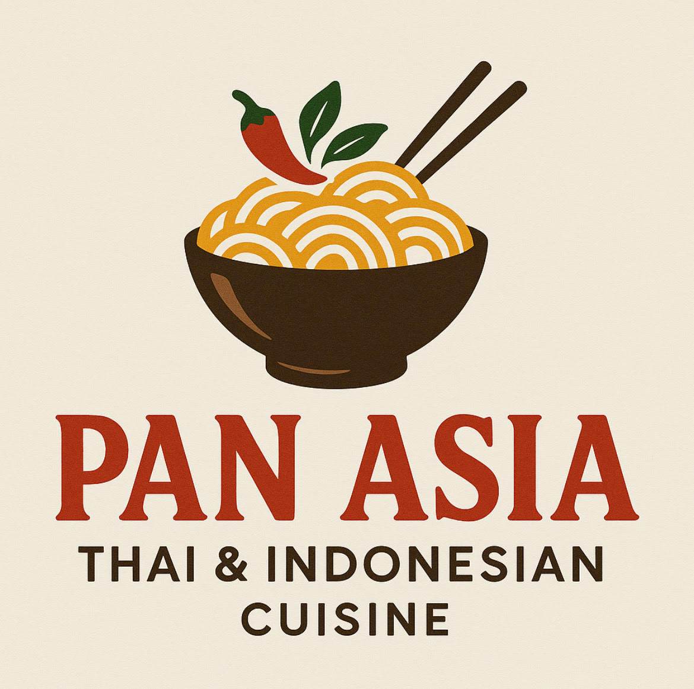

<!DOCTYPE html>
<html lang="en">
<head>
  <meta charset="UTF-8" />
  <meta name="viewport" content="width=device-width, initial-scale=1.0" />
  <title>Pan Asia - Thai & Indo</title>
  
</head>
<body>
  <header>
    
    <h2>Pan Asia - Thai & Indo</h2>
    <nav>
      <a href="#contact">Contact</a>
    </nav>
  </header>

  <section class="hero">
    <h1>Welcome to Pan Asia</h1>
    
Authentic Thai & Indonesian Flavors

  </section>

  <section class="intro">
    We are a <b>food-focused</b> Thai & Indonesian kitchen (takeout & delivery). We craft bold, fresh flavors using quality ingredients and our house-made sauces. Enjoy Pad Thai, fragrant curries, and Indonesian favorites prepared fast and with care.
  </section>

  <!-- ✅ 수정된 부분: Uber Eats Webshop으로 이동 -->
  <form action="https://www.order.store/store/pan-asia-thai%26indo-bldg-3-20381-62-avenue/FioLAblDUoGzdeXSNftThw" method="get" style="text-align:center;">
    <button type="submit" class="order-btn">Order Now</button>
  </form>

  <footer id="contact">
    
Pan Asia - Thai & Indo | 200381 62 Ave Unit 301, Langley, BC, V3A 5E6, Canada

  </footer>
</body>
